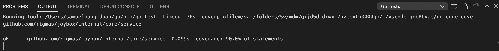
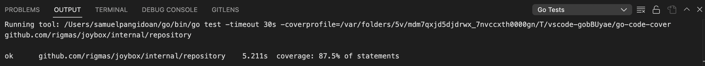
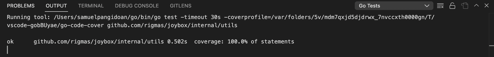

# Introduction

This is prototype backend for e-library that use `https://openlibrary.org/` API to fetch books data.   
This app is built using `Go v1.18` and also have implemented unit tests using `testify`    

Unit test results:  

1.  `/internal/core/service`
    
      
2.  `/internal/repository`
    
      
3.  `/internal/utils`
    
       

# How to run

### Prerequisites:

    - Make sure you have `Golang` environment (Go v1.18)
    - Make sure you have `Make` environment
    - Make sure you have installed `postman`

1. Run command `make run-api` on your terminal at base directory of this project.
2. See `./joybox.postman_collection.json` to see how these API works.
